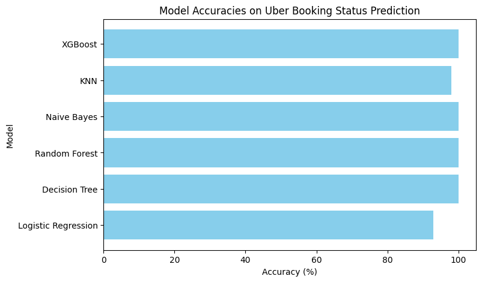

# 🚕 Uber Rides Analysis

## 📌 Project Overview

This project focuses on analyzing Uber ride data to uncover travel patterns, ride trends, and customer behavior using Python and Machine Learning. The dataset was cleaned, processed, visualized, and used to train multiple classification models to gain insights and evaluate predictive performance.

The project demonstrates the complete data science workflow, including data preprocessing, exploratory data analysis (EDA), feature engineering, visualization, model training, and performance evaluation.

---

## 🎯 Objectives

- Clean and preprocess Uber ride data.
- Perform Exploratory Data Analysis (EDA).
- Identify ride trends and patterns.
- Visualize important insights using charts and graphs.
- Train and evaluate multiple Machine Learning models.
- Compare model performance using accuracy scores.

---

## 🛠️ Technologies Used

- Python
- Google Colab
- Pandas
- NumPy
- Matplotlib
- Seaborn
- Scikit-learn
- XGBoost

---

## 📚 Libraries Used

```python
import numpy as np
import pandas as pd
import seaborn as sns
import matplotlib.pyplot as plt

from sklearn.linear_model import LogisticRegression
from sklearn.metrics import accuracy_score
from sklearn.model_selection import train_test_split
from sklearn.feature_extraction.text import TfidfVectorizer
from sklearn.preprocessing import LabelEncoder, StandardScaler
from sklearn.tree import DecisionTreeClassifier
from sklearn.ensemble import RandomForestClassifier
from sklearn.naive_bayes import GaussianNB
from sklearn.neighbors import KNeighborsClassifier
```

---

## 📊 Exploratory Data Analysis

The dataset was analyzed to understand:

- Ride distribution
- Customer travel behavior
- Feature relationships
- Trends and patterns in ride activity
- Data quality and missing values

Visualization techniques were used to convert raw data into meaningful insights.

---

## 🖼️ Project Visualization

### Analysis Dashboard



---

## ⚙️ Data Preprocessing

The following preprocessing techniques were applied:

- Data Cleaning
- Handling Missing Values
- Label Encoding
- Feature Transformation
- Standard Scaling
- TF-IDF Vectorization
- Train-Test Split

These steps ensured the dataset was properly prepared for machine learning.

---

## 🤖 Machine Learning Models Used

The following classification algorithms were implemented:

1. Logistic Regression
2. Decision Tree Classifier
3. Random Forest Classifier
4. Gaussian Naive Bayes
5. K-Nearest Neighbors (KNN)
6. XGBoost Classifier

---

## 📈 Model Performance

| Model | Accuracy (%) |

| Logistic Regression | 93.01 |
| Decision Tree | 100.00 |
| Random Forest | 100.00 |
| Naive Bayes | 100.00 |
| K-Nearest Neighbors (KNN) | 97.96 |
| XGBoost | 100.00 |

### Performance Summary

- Best Accuracy Achieved: **100.00%**
- Highest Performing Models:
  - Decision Tree
  - Random Forest
  - Naive Bayes
  - XGBoost
- Logistic Regression achieved **93.01%** accuracy.
- KNN achieved **97.96%** accuracy.

> Note: Perfect accuracy may indicate that the dataset is highly separable. Additional validation techniques can be applied to further verify model generalization.

---

## 📁 Project Structure

```
Uber-Rides-Analysis/
│
├── Uber_Rides_Analysis.ipynb
├── uber_dataset.csv
├── image.png
├── README.md
```

## 🔍 Key Learning Outcomes

- Data Cleaning and Preparation
- Exploratory Data Analysis (EDA)
- Data Visualization
- Feature Engineering
- Machine Learning Model Development
- Model Evaluation and Comparison
- Working with Real-World Datasets
- End-to-End Data Science Workflow

---

## 📌 Future Improvements

- Hyperparameter tuning for improved model robustness.
- Cross-validation for better generalization.
- Deployment of the trained model as a web application.
- Integration of larger real-world ride datasets.
- Advanced feature engineering techniques.

---

## 👨‍💻 Author

**Nirjala Dixit**

Data Science and Machine Learning project developed for learning, experimentation, and portfolio building using Python, Google Colab, and modern machine learning techniques.

---

⭐ If you found this project useful, consider giving the repository a star.
